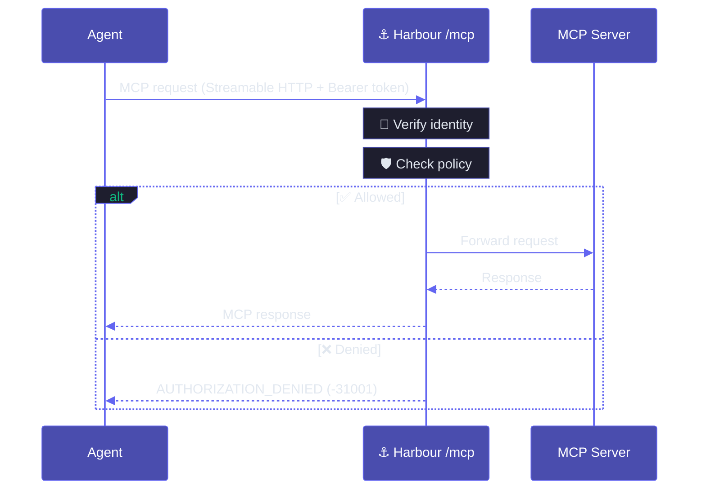

## Overview

MCP Harbour is the port authority for your MCP servers. It aggregates multiple servers into a single endpoint, manages their lifecycle, and enforces per-agent security policies. It implements the [GPARS](https://gpars.io) plane boundary — agents never talk to MCP servers directly.

## System Diagram

  {/* Agents */}
  

    Agents
  

  

    {['VS Code', 'Claude Code', 'Cursor', 'OpenCode'].map((name) => (
      

        {name}
      

    ))}
  

  {/* Arrow: agents → daemon */}
  
▼ Streamable HTTP + Bearer token

  {/* Harbour Daemon */}
  

    

      Harbour Daemon
       /mcp
    

    {/* Auth */}
    

      <svg width="16" height="16" viewBox="0 0 24 24" fill="none" stroke="currentColor" strokeWidth="2" strokeLinecap="round" strokeLinejoin="round"><rect x="3" y="11" width="18" height="11" rx="2" ry="2"/><path d="M7 11V7a5 5 0 0 1 10 0v4"/></svg>
      Identity Verification
    

    {/* Sessions */}
    

      {[{ l: 'Session A', p: 'read only' }, { l: 'Session B', p: 'full access' }, { l: 'Session C', p: 'git only' }].map((s) => (
        

          
{s.l}

          
{s.p}

        

      ))}
    

    {/* Policy + Tool Routing */}
    

      

        <svg width="16" height="16" viewBox="0 0 24 24" fill="none" stroke="currentColor" strokeWidth="2" strokeLinecap="round" strokeLinejoin="round"><path d="M12 22s8-4 8-10V5l-8-3-8 3v7c0 6 8 10 8 10z"/></svg>
        Policy Enforcement
      

      

        <svg width="16" height="16" viewBox="0 0 24 24" fill="none" stroke="currentColor" strokeWidth="2" strokeLinecap="round" strokeLinejoin="round"><circle cx="12" cy="12" r="10"/><path d="M8 12h8"/><path d="M12 8l4 4-4 4"/></svg>
        Tool Routing
      

    

  

  {/* Arrow: daemon → servers */}
  
▼ spawn / connect

  {/* MCP Servers */}
  

    MCP Servers
  

  

    {[
      { name: 'filesystem', icon: <svg width="16" height="16" viewBox="0 0 24 24" fill="none" stroke="#6ee7b7" strokeWidth="2" strokeLinecap="round" strokeLinejoin="round"><path d="M22 19a2 2 0 0 1-2 2H4a2 2 0 0 1-2-2V5a2 2 0 0 1 2-2h5l2 3h9a2 2 0 0 1 2 2z"/></svg> },
      { name: 'git', icon: <svg width="16" height="16" viewBox="0 0 24 24" fill="none" stroke="#6ee7b7" strokeWidth="2" strokeLinecap="round" strokeLinejoin="round"><circle cx="18" cy="18" r="3"/><circle cx="6" cy="6" r="3"/><path d="M13 6h3a2 2 0 0 1 2 2v7"/><line x1="6" y1="9" x2="6" y2="21"/></svg> },
      { name: 'database', icon: <svg width="16" height="16" viewBox="0 0 24 24" fill="none" stroke="#6ee7b7" strokeWidth="2" strokeLinecap="round" strokeLinejoin="round"><ellipse cx="12" cy="5" rx="9" ry="3"/><path d="M21 12c0 1.66-4 3-9 3s-9-1.34-9-3"/><path d="M3 5v14c0 1.66 4 3 9 3s9-1.34 9-3V5"/></svg> }
    ].map((s) => (
      

        {s.icon}
        {s.name}
      

    ))}
  

## Request Flow

## Entry Points

<CardGroup cols={2}>
  <Card title="harbour" icon="terminal" color="#10b981">
    Admin CLI for the user. Manages servers, identities, policies, and the daemon. Belongs to the Action Plane.
  </Card>
  <Card title="/mcp" icon="globe" color="#10b981">
    Streamable HTTP MCP endpoint for agents. Requires Bearer authentication and has no admin commands.
  </Card>
</CardGroup>

Agents connect to `/mcp`; they do not run the `harbour` admin CLI.

## Process isolation

<CardGroup cols={2}>
  <Card title="Stdio servers" icon="box" color="#10b981">
    Started and managed by the daemon as docked server processes.
  </Card>
  <Card title="Streamable HTTP servers" icon="globe" color="#10b981">
    Connected by the daemon as shared docked server sessions.
  </Card>
</CardGroup>

## Connection Flow

<Steps>
  <Step title="Client connects">
    The MCP client connects to `http://127.0.0.1:4767/mcp` using Streamable HTTP.
  </Step>
  <Step title="Authentication">
    The client sends `Authorization: Bearer harbour_sk_...`. The daemon derives the identity by checking the token against stored hashes. The agent cannot self-declare its identity.
  </Step>
  <Step title="Request authorized">
    The shared MCP server resolves the identity's policy and filters or routes tools through daemon-managed docked servers.
  </Step>
  <Step title="MCP traffic flows">
    Standard MCP traffic flows through the harbour. Every `call_tool` is checked against the policy before forwarding.
  </Step>
</Steps>

## GPARS Alignment

| GPARS Concept | MCP Harbour |
|---|---|
| Cognitive Plane | Agent + MCP client |
| Action Plane | MCP servers + security policies |
| Plane Boundary | Harbour daemon `/mcp` endpoint |
| Security Policy | Per-identity policy files |
| `AUTHORIZATION_DENIED` | JSON-RPC error code `-31001` |
| `SERVER_UNAVAILABLE` | JSON-RPC error code `-31002` |
| Identity verification | Bearer token → identity lookup |
| Default deny | No policy = no access |
